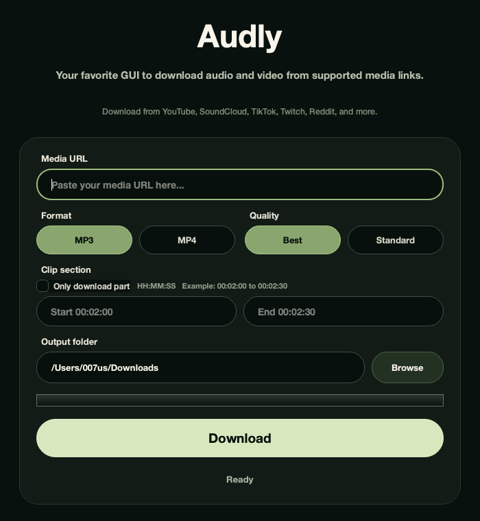

# Audly

A polished desktop GUI for downloading and clipping media with yt-dlp and FFmpeg without writing terminal commands.

Audly wraps common `yt-dlp` workflows in a clean PySide6 interface for users who want MP3/MP4 downloads, clipping, output-folder selection, and progress feedback from a native desktop app.



## Features

- MP3 / MP4 downloads
- Best / Standard quality options
- Clip timestamps for partial downloads
- Output folder selection
- Real-time progress UI

## Tech Stack

- Python
- PySide6
- yt-dlp
- FFmpeg
- PyInstaller

## Resume-Ready Project Bullets

- Built a polished macOS desktop GUI for media downloading and clipping using Python, PySide6, yt-dlp, and FFmpeg.
- Implemented threaded downloads with real-time progress updates using QThread to maintain UI responsiveness.
- Designed a system that dynamically generates yt-dlp CLI commands based on user input.
- Packaged the application into native executables (.app and .exe) using PyInstaller.

## How It Works

Audly converts form input into a structured `yt-dlp` command. The GUI collects the media URL, output folder, target format, quality level, and optional start/end timestamps, then builds the matching CLI arguments programmatically.

Downloads run through Python's `subprocess.Popen`, which starts `yt-dlp` as a child process and streams combined stdout/stderr back into the app. This keeps the implementation close to the official command-line behavior while giving users a desktop interface.

Long-running downloads execute inside a `QThread` worker. The worker keeps the Qt event loop responsive while emitting signals for progress, status changes, completion, and failure states.

Audly parses `yt-dlp` output lines for progress percentages such as `[download] 42.0%`. Those values are converted into progress-bar updates, while other output markers like extraction, merging, and destination messages are translated into readable UI status text.

The result is a CLI abstraction layer: users interact with buttons and fields, while Audly safely generates and runs the appropriate `yt-dlp` command in the background.

## Platform Support

- macOS native app bundle (`.app`)
- Windows executable (`.exe`)

## Requirements

- Python 3.12+
- uv
- FFmpeg installed and available on PATH

`yt-dlp`, PySide6, and PyInstaller are installed from the Python project dependencies.

## Installation (Development)

```bash
uv run audly.py
```

## Build Instructions

### macOS

```bash
pyinstaller --windowed --icon=matcha.icns audly.py
```

### Windows

Generate `matcha.ico` from `matchaicon.png` before building:

```bash
python -m pip install pillow
python -c "from PIL import Image; img = Image.open('matchaicon.png'); img.save('matcha.ico', sizes=[(16,16),(32,32),(48,48),(64,64),(128,128),(256,256)])"
```

Then build the executable:

```bash
pyinstaller --windowed --onefile --icon=matcha.ico audly.py
```

## Release Instructions

Create release archives from the PyInstaller output:

```bash
zip -r Audly-macOS.zip dist/audly.app
zip Audly-Windows.zip dist/audly.exe
```

On macOS, Audly is currently unsigned. If macOS blocks the app on first launch, right click the app and choose Open.

## Automated Builds

GitHub Actions builds Audly on both `macos-latest` and `windows-latest` for every push and published release. The workflow uploads the macOS `.app` bundle and Windows `.exe` as downloadable artifacts, so a Windows machine is not required to produce the Windows release build.

## License

MIT License. See `LICENSE` for details.
